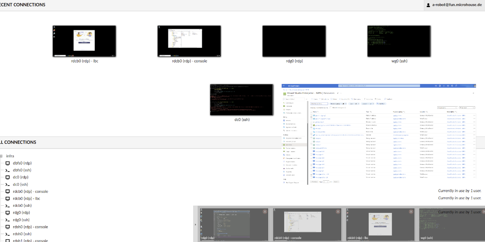
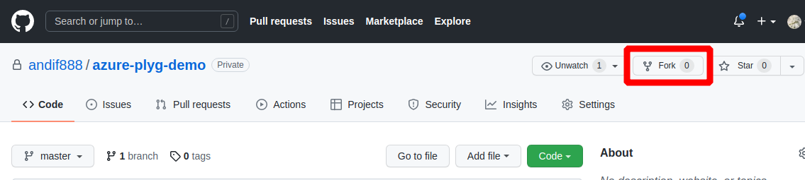
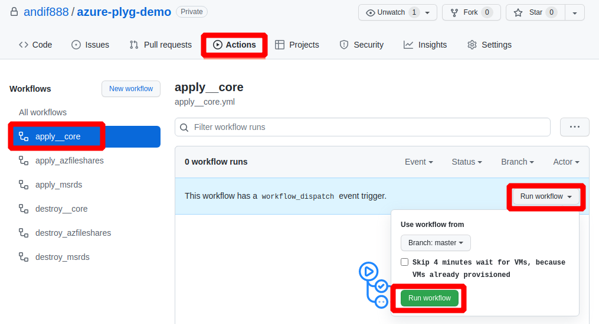
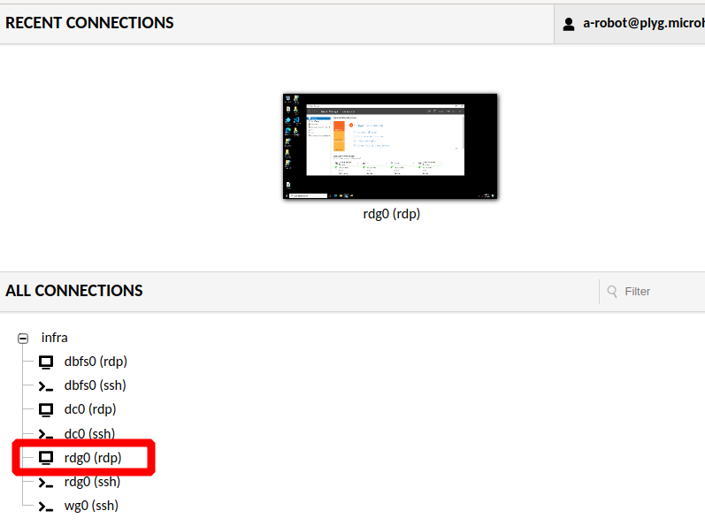

# one-click azure playground

This repo creates an azure playground environment. It provisions a few small infrastructure VMs to enable convenient remote access to the environment. The core environment automatically configures infrastructure services like Active Directory, Fileshares, SQL, Remote Desktop Gateway Remote Access including public SSL certificates.  
The environment can serve any purpose but the many motivation is to automatically provision an environment which acts as your TestLab or HomeLab in the Azure cloud, which allows you ...

- ... to easily test software and configurations
- ... to have infrastructure services like Active Directory, Fileshares, SQL, Remote Access including public SSL certificates in place with one click.
- ... destroy and recreate everything anytime with one click

#### The core environment provisions the following components

- **Windows Domain Controller**  (Windows Server 2022 Core)   
  Hostname: `DC0`  
  Active Directory gets automatically installed and configured. Also a bunch of users, groups and OUs are created.

- **Microsoft Remote Desktop Gateway** (Windows Server 2022)   
  Hostname: `RDG0`   
  A RDG gets automatically installed and configured with a valid and automatically renewed Letsencrypt certificate, to easily remote into your VMs using RDP. This machine has a Windows Desktop, because it's not Server Core and can act as managment VM. It has all the necessary RSAT tools installed to manage DC, DNS and so on.

- **Windows File Server and SQL Server** (Windows Server 2022 Core)  
  Hostname: `DBFS0`  
  Sooner or later every environments needs fileshares and some SQL and it's always tendious to set them up manually.

- **Apache Guacamole (HTML5 RDG)** (Docker Containers on Ubuntu 20.04)   
  Hostname: `WG0`  
  Accessing your lab using a webbrowser from any device is priceless. Gacamole gets fully configured, already containing all VM connections and fully integrated into Active Directory authentication.

All those infrastructure VMs are small Azure **B1** and **B2** vm-sizes and are intentionally configured with unmanaged disks in a Standard LRS storage account to keep azure costs at an absolute minimum.

Scaling it to powerful VMs with managed premium SSD or ephemeral disk for some good use-cases is easy.

## Pre-requesites

1. You need an **Azure Subscription**   
   Maybe you have an existing one. Any subscription is fine. Even MSDN subscriptions or [Azure Free Trials](https://azure.microsoft.com/en-us/offers/ms-azr-0044p/) which come with USD200 azure credits are absolutely sufficient.  

2. You need an **Azure Service Principal**   
   The azure service principal needs to have `contributor` permission on your Azure Subscription.   
   Checkout: [How to prepare a azure service principal](./docs/how_to_prepare_a_azure_service_principal.md).

3. You need an existing **Azure Storage Account**   
   This is used for storing small terraform state files. Your azure service principal needs read/write access permission to this storage account. This storage account can be re-used for multiple environments.  
   Checkout: [How to prepare the azure storage account](./docs/how_to_prepare_the_azure_storage_account.md).

4. You need a public **Domain Name** at any Domain Hosting provider   
   This is used to make the environment your own. This enables you to access your environment using your own Domain Name. This can be any exisiting one. We only need to create two DNS CNAME Records, which acts like a subdomain. So no worry, we are not going to fuck up anything at your base domain. To understand why we need a **reverse proxy dns hostname** and a **public hosting domain** defined and how you choose the correct values, read the following:    
   Checkout: [How to prepare your public Domain Name with DNS CNAME records](./docs/how_to_prepare_your_public_domain_name_with_dns_cname_records.md)   

5. You need a **SSH Private Key**   
   All VMs are automatically configured with OpenSSH. Ansible is used as configuration management tool and it connects to your VMs using SSH tunneling which requires a SSH key.   
   Checkout: [How to prepare a SSH Private Key](./docs/how_to_prepare_a_ssh_private_key.md)

## How to use the repo

### 1. Fork the repo

Fork the repo. Take it. It must be yours. Is going to be your environment, not mine.

### 2. Adjust variables of [sample.env](./sample.env)

Copy the contents of [sample.env](./sample.env) to and editor and adjust the variables according to the **pre-requisites**. Adjust at minimum **all** mandatory variables.   
Pay close attention when there is something like *`"must be unique"`*. It's truely meant as *must* and not as *can*. So, change it!    
If you cloned the repo locally and intent to run the build locally then copy the [sample.env](./sample.env) to `.env` and make your adjustments there. `.env` is in the [.gitignore](./.gitignore) and will never be git pushed.

### 3. Create Github secret from your [sample.env](./sample.env)

Copy the complete content of your adjusted [sample.env](./sample.env) into a Github secret named `envfile`   
Checkout: [How to create envfile as Github secret](./docs/how_to_create_envfile_as_github_secret.md)

### 4. Create Github secret from your SSH private key

Copy the complete content of your SSH private key into a Github secret named `TF_VAR_ssh_private_key_pem`  
Checkout: [How to prepare a SSH Private Key](./docs/how_to_prepare_a_ssh_private_key.md)

### 5. Click and Run the Github Action Workflow

Click **Actions**, select the **apply__core** workflow and run the workflow.

### 6. Wait until Workflow has finished or do some pleasant things ...

In your webbrowser open [https://guac.`<value of TF_VAR_public_hosting_domain>`](df).  

Login with AD userPrincipalName:  
Username: `<value of TF_VAR_azure_vm_admin_username>`@`<value of TF_VAR_ad_domain_name>`  
Password: `[value of TF_VAR_azure_vm_admin_password]`

Under **All Connection** find and click `rdg0 (rdp)`. Now you are logged in into your managment VM and you can look around.

## Additional info about Workflows

There a currently 6 different workflows in Github Actions

3 Workflows are for provision and configuration. The other 3 are the corresponding ones to delete the resources.

### 1. apply__core

This is the [core workflow](./.github/workflows/apply__core.yml) to provision the initial environment including Domain Controller, Guacamole, RD Gateway, Fileserver und SQL Server.

In general the workflow can be run multiple times. On each workflow run a new git tag is generated and the `minior` version number is incremented automatically. An new `release` is automatically created from the new tag. Your environment details are presented as release info in the Github repo.

### 2. apply_msrds

[This workflow](./.github/workflows/apply_msrds.yml) provisions a complete Microsoft Remote Desktop Deployment. Before you run this workflow the core environment must already exist. This workflow installs:

- Remote Desktop Web Access
- Remote Desktop Connection Broker
- Remote Desktop Session Hosts

Valid SSL Certificates are automatically requested and installed. Host connections in Guacamole automatically added.

In general the workflow can be run multiple times. On each workflow run a new git tag is generated and the `patch` version number is incremented automatically. An new `release` is automatically created from the new tag. Your environment details are presented as release info in the Github repo.

### 3. apply_azfileshares

[This workflow](./.github/workflows/apply_azfileshares.yml) provisions Azure Fileshare. It does only make sense to use this workflow as soon as you have implemented **Azure AD Connect** in your environment. To access Azure Fileshare corresponding AD Users must have been synced to AzureAD.
As soon as Azure AD Connect is up an running you can use this workflow to provision Azure Fileshares. This workflow also handles the domainjoin on of the Azure Storage Account.

In general the workflow can be run multiple times. On each workflow run a new git tag is generated and the `patch` version number is incremented automatically. An new `release` is automatically created from the new tag. Your environment details are presented as release info in the Github repo.

## Destroying the enviroment

If you want to teardown the whole environment, make sure to do it in the revers. If you have for example Azure Fileshare, the run [destroy_azfileshares](./.github/workflows/destroy_azfileshares.yml) first before running the [destroy__core](./.github/workflows/destroy__core.yml) workflow.

The same is true if you have uses [provision_msrds](./.github/workflows/provision_msrds.yml). First use [destroy_msrds](./.github/workflows/destroy_msrds.yml) before running the [destroy__core](./.github/workflows/destroy__core.yml) workflow.
