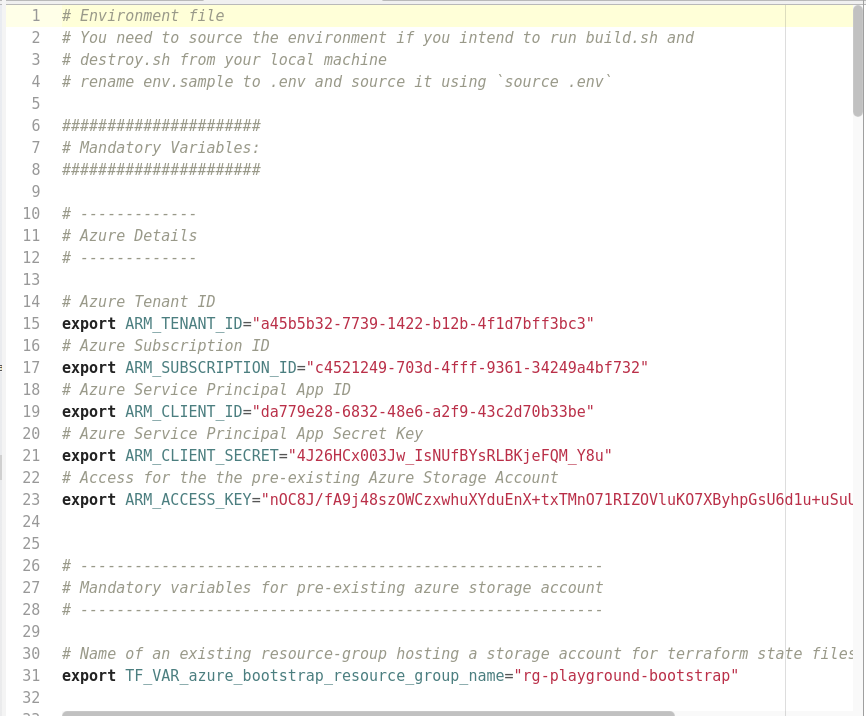
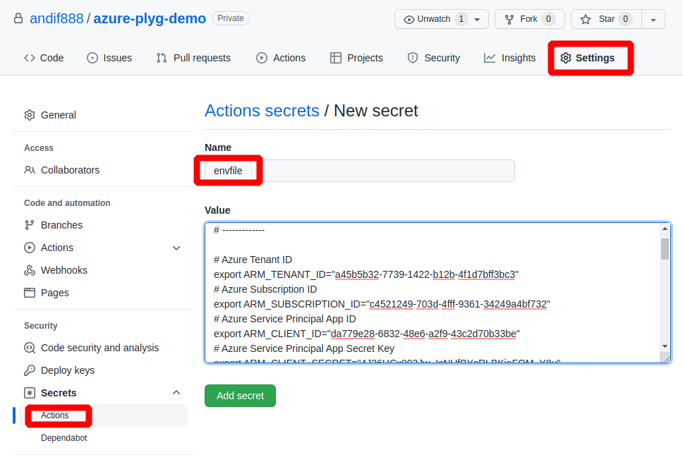

# How to create envfile as Github secret

### Copy contents of .env file to a Github Action secret named `envfile`

You have adjusted the [sample.env](./sample.env) according to your needs and pre-requisites. Select all and copy the content to the clipboard.

In your forked Github repo create a **new repository secret** using **Settings** > **Secrets** > **Actions** > **New repository secret** named `envfile` and paste the contents from the clipboard into the **Value** field.

