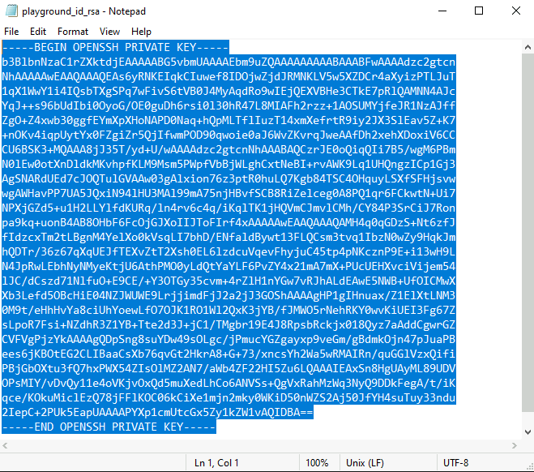
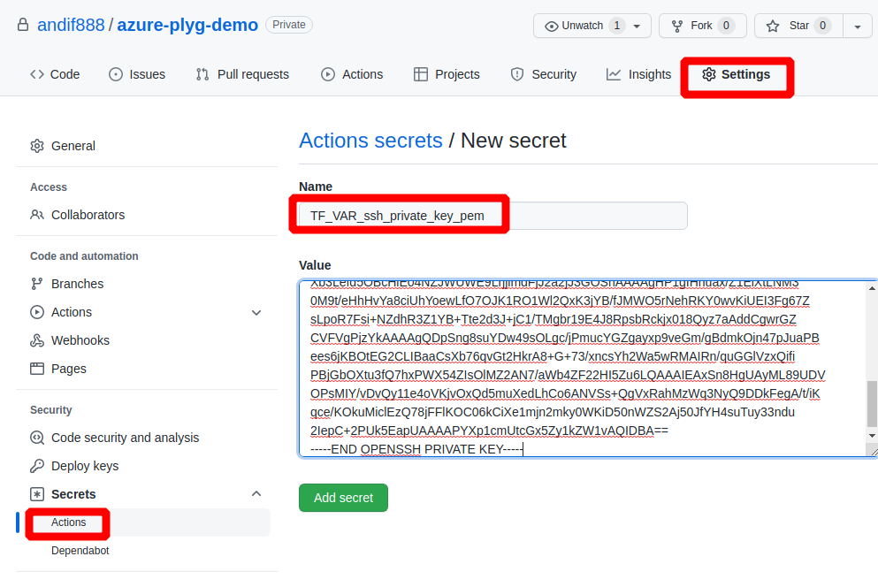

# How to prepare a SSH Private Key

You need a private key file.  
This is used for OpenSSH inside the VMs.

Example command to generate private key on Linux:

```bash
ssh-keygen -f ~/.ssh/playground_id_rsa -t rsa -b 2048 -C "azure-plyg-demo"
```

Example command to generate private key on Windows:

```cmd
cd %USERPROFILE%
mkdir .ssh
ssh-keygen -f .ssh/playground_id_rsa -t rsa -b 2048 -C "azure-plyg-demo"
```

Make sure your private key does not exceed 2048 bytes (-b 2048).   
I ran into error in terraform when using -b 4096.

### Copy the private key to a Github Action secret named `TF_VAR_ssh_private_key_pem`

Open the private key in an editor (on Windows in Notepad), select an copy to clipboard.



In your forked Github repo create a **new repository secret** using **Settings** > **Secrets** > **Actions** > **New repository secret** named `TF_VAR_ssh_private_key_pem` and paste the contents of the private key file into the **Value** field.


